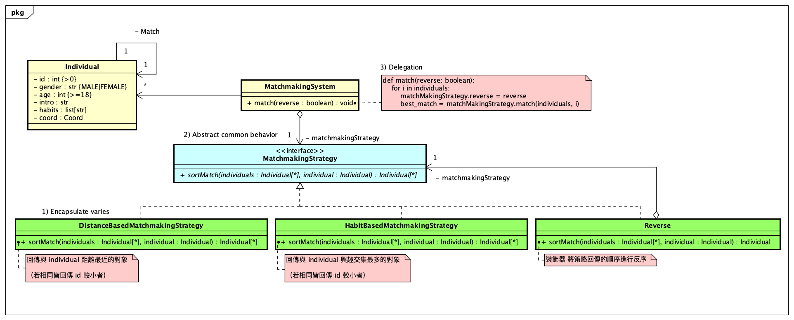

# [2.1.H] Match System (Strategy Method)

> Author: @A-baoYang (jyabaodsda)

### Object Oriented Analysis & Design (OOA/D)



### Run 
```bash
cd code
python main.py
```

- Logging
```bash
Gender: (MALE or FEMALE)MALE
Age: (>=18)19
Intro: (<= 200 words)Hi
Habits: (<= 10 keywords, split with ',')跳舞,rap
X-axis (float): 4.5
Y-axis (float): 1.9
User#5467 registered successfully
Enter another user? (Y/N)Y
Gender: (MALE or FEMALE)MALE
Age: (>=18)19
Intro: (<= 200 words)Hi
Habits: (<= 10 keywords, split with ',')rap,看書
X-axis (float): 1.3
Y-axis (float): 6.7
User#25562 registered successfully
Enter another user? (Y/N)Y
Gender: (MALE or FEMALE)FEMALE
Age: (>=18)19
Intro: (<= 200 words)Hi
Habits: (<= 10 keywords, split with ',')跑步,跳舞,rap
X-axis (float): 1.4
Y-axis (float): 6.7
User#67339 registered successfully
Enter another user? (Y/N)N
Which matching strategy do you like to use? {distance, habit}habit
Do you want to make reverse recommandations? (Y/N)N
Match Result: {Individual#5467: [Individual#67339, Individual#25562], Individual#25562: [Individual#5467, Individual#67339], Individual#67339: [Individual#5467, Individual#25562]}
```