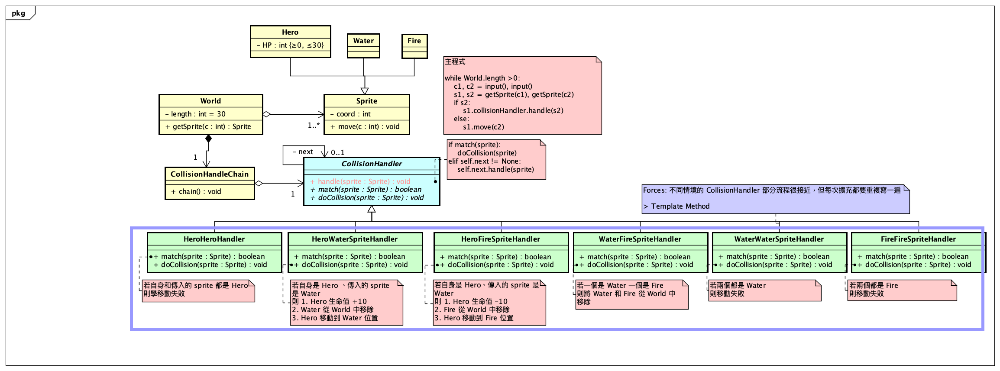

# [2.3.H] 碰撞案例 (Chain of Responsibility 責任鏈模式)

> Author: @A-baoYang (jyabaodsda)

### Object Oriented Analysis & Design (OOA/D)



### Run 
```bash
cd code
python main.py
```

- Logging

```bash
defaultdict(<function World.arrange_sprites.<locals>.<lambda> at 0x7f84ea9d29d0>, {1: <class 'sprite.Water'> (x: 1), 2: <class 'sprite.Fire'> (x: 2), 4: <class 'sprite.Hero'> (x: 4), 5: <class 'sprite.Fire'> (x: 5), 7: <class 'sprite.Hero'> (x: 7), 8: <class 'sprite.Fire'> (x: 8), 9: <class 'sprite.Water'> (x: 9), 10: <class 'sprite.Water'> (x: 10), 11: <class 'sprite.Fire'> (x: 11), 12: <class 'sprite.Fire'> (x: 12), 13: <class 'sprite.Water'> (x: 13), 14: <class 'sprite.Hero'> (x: 14), 15: <class 'sprite.Hero'> (x: 15), 16: <class 'sprite.Fire'> (x: 16), 17: <class 'sprite.Hero'> (x: 17), 19: <class 'sprite.Water'> (x: 19), 20: <class 'sprite.Fire'> (x: 20), 21: <class 'sprite.Fire'> (x: 21), 22: <class 'sprite.Fire'> (x: 22), 23: <class 'sprite.Hero'> (x: 23), 25: <class 'sprite.Hero'> (x: 25), 27: <class 'sprite.Water'> (x: 27), 28: <class 'sprite.Water'> (x: 28)})
Input a coord of a sprite (int): 1
Move to another coord (int): 4
defaultdict(<function World.arrange_sprites.<locals>.<lambda> at 0x7f84ea9d29d0>, {2: <class 'sprite.Fire'> (x: 2), 4: None, 5: <class 'sprite.Fire'> (x: 5), 7: <class 'sprite.Hero'> (x: 7), 8: <class 'sprite.Fire'> (x: 8), 9: <class 'sprite.Water'> (x: 9), 10: <class 'sprite.Water'> (x: 10), 11: <class 'sprite.Fire'> (x: 11), 12: <class 'sprite.Fire'> (x: 12), 13: <class 'sprite.Water'> (x: 13), 14: <class 'sprite.Hero'> (x: 14), 15: <class 'sprite.Hero'> (x: 15), 16: <class 'sprite.Fire'> (x: 16), 17: <class 'sprite.Hero'> (x: 17), 19: <class 'sprite.Water'> (x: 19), 20: <class 'sprite.Fire'> (x: 20), 21: <class 'sprite.Fire'> (x: 21), 22: <class 'sprite.Fire'> (x: 22), 23: <class 'sprite.Hero'> (x: 23), 25: <class 'sprite.Hero'> (x: 25), 27: <class 'sprite.Water'> (x: 27), 28: <class 'sprite.Water'> (x: 28), 1: <class 'sprite.Hero'> (x: 1)})
Input a coord of a sprite (int): ^CTraceback (most recent call last):
  File "main.py", line 12, in <module>
    c1 = int(input("Input a coord of a sprite (int): "))
KeyboardInterrupt

(base) jiunyiyangde-MacBook-Pro:code jiunyiyang$ python main.py 
defaultdict(<function World.arrange_sprites.<locals>.<lambda> at 0x7fc686adce50>, {0: <class 'sprite.Hero'> (x: 0), 1: <class 'sprite.Hero'> (x: 1), 2: <class 'sprite.Water'> (x: 2), 3: <class 'sprite.Fire'> (x: 3), 4: <class 'sprite.Hero'> (x: 4), 7: <class 'sprite.Hero'> (x: 7), 8: <class 'sprite.Water'> (x: 8), 11: <class 'sprite.Fire'> (x: 11), 12: <class 'sprite.Fire'> (x: 12), 14: <class 'sprite.Water'> (x: 14), 17: <class 'sprite.Water'> (x: 17), 18: <class 'sprite.Fire'> (x: 18), 20: <class 'sprite.Fire'> (x: 20), 22: <class 'sprite.Water'> (x: 22), 23: <class 'sprite.Fire'> (x: 23), 24: <class 'sprite.Water'> (x: 24), 26: <class 'sprite.Water'> (x: 26)})
Input a coord of a sprite (int): 2
Move to another coord (int): 1
defaultdict(<function World.arrange_sprites.<locals>.<lambda> at 0x7fc686adce50>, {0: <class 'sprite.Hero'> (x: 0), 1: None, 3: <class 'sprite.Fire'> (x: 3), 4: <class 'sprite.Hero'> (x: 4), 7: <class 'sprite.Hero'> (x: 7), 8: <class 'sprite.Water'> (x: 8), 11: <class 'sprite.Fire'> (x: 11), 12: <class 'sprite.Fire'> (x: 12), 14: <class 'sprite.Water'> (x: 14), 17: <class 'sprite.Water'> (x: 17), 18: <class 'sprite.Fire'> (x: 18), 20: <class 'sprite.Fire'> (x: 20), 22: <class 'sprite.Water'> (x: 22), 23: <class 'sprite.Fire'> (x: 23), 24: <class 'sprite.Water'> (x: 24), 26: <class 'sprite.Water'> (x: 26), 2: <class 'sprite.Hero'> (x: 2)})
Input a coord of a sprite (int): ^[[A^CTraceback (most recent call last):
  File "main.py", line 12, in <module>
    c1 = int(input("Input a coord of a sprite (int): "))
KeyboardInterrupt

(base) jiunyiyangde-MacBook-Pro:code jiunyiyang$ python main.py 
defaultdict(<function World.arrange_sprites.<locals>.<lambda> at 0x7f93976d29d0>, {0: <class 'sprite.Hero'> (x: 0), 1: <class 'sprite.Fire'> (x: 1), 2: <class 'sprite.Fire'> (x: 2), 3: <class 'sprite.Hero'> (x: 3), 5: <class 'sprite.Fire'> (x: 5), 6: <class 'sprite.Water'> (x: 6), 7: <class 'sprite.Fire'> (x: 7), 8: <class 'sprite.Water'> (x: 8), 9: <class 'sprite.Fire'> (x: 9), 10: <class 'sprite.Water'> (x: 10), 11: <class 'sprite.Water'> (x: 11), 14: <class 'sprite.Fire'> (x: 14), 15: <class 'sprite.Fire'> (x: 15), 16: <class 'sprite.Water'> (x: 16), 17: <class 'sprite.Water'> (x: 17), 18: <class 'sprite.Water'> (x: 18), 20: <class 'sprite.Hero'> (x: 20), 21: <class 'sprite.Hero'> (x: 21), 23: <class 'sprite.Water'> (x: 23), 25: <class 'sprite.Hero'> (x: 25), 26: <class 'sprite.Hero'> (x: 26), 27: <class 'sprite.Water'> (x: 27), 28: <class 'sprite.Fire'> (x: 28)})
Input a coord of a sprite (int): 1
Move to another coord (int): 0
defaultdict(<function World.arrange_sprites.<locals>.<lambda> at 0x7f93976d29d0>, {0: <class 'sprite.Hero'> (x: 0), 2: <class 'sprite.Fire'> (x: 2), 3: <class 'sprite.Hero'> (x: 3), 5: <class 'sprite.Fire'> (x: 5), 6: <class 'sprite.Water'> (x: 6), 7: <class 'sprite.Fire'> (x: 7), 8: <class 'sprite.Water'> (x: 8), 9: <class 'sprite.Fire'> (x: 9), 10: <class 'sprite.Water'> (x: 10), 11: <class 'sprite.Water'> (x: 11), 14: <class 'sprite.Fire'> (x: 14), 15: <class 'sprite.Fire'> (x: 15), 16: <class 'sprite.Water'> (x: 16), 17: <class 'sprite.Water'> (x: 17), 18: <class 'sprite.Water'> (x: 18), 20: <class 'sprite.Hero'> (x: 20), 21: <class 'sprite.Hero'> (x: 21), 23: <class 'sprite.Water'> (x: 23), 25: <class 'sprite.Hero'> (x: 25), 26: <class 'sprite.Hero'> (x: 26), 27: <class 'sprite.Water'> (x: 27), 28: <class 'sprite.Fire'> (x: 28)})
Input a coord of a sprite (int): 18
Move to another coord (int): 20
defaultdict(<function World.arrange_sprites.<locals>.<lambda> at 0x7f93976d29d0>, {0: <class 'sprite.Hero'> (x: 0), 2: <class 'sprite.Fire'> (x: 2), 3: <class 'sprite.Hero'> (x: 3), 5: <class 'sprite.Fire'> (x: 5), 6: <class 'sprite.Water'> (x: 6), 7: <class 'sprite.Fire'> (x: 7), 8: <class 'sprite.Water'> (x: 8), 9: <class 'sprite.Fire'> (x: 9), 10: <class 'sprite.Water'> (x: 10), 11: <class 'sprite.Water'> (x: 11), 14: <class 'sprite.Fire'> (x: 14), 15: <class 'sprite.Fire'> (x: 15), 16: <class 'sprite.Water'> (x: 16), 17: <class 'sprite.Water'> (x: 17), 20: <class 'sprite.Hero'> (x: 20), 21: <class 'sprite.Hero'> (x: 21), 23: <class 'sprite.Water'> (x: 23), 25: <class 'sprite.Hero'> (x: 25), 26: <class 'sprite.Hero'> (x: 26), 27: <class 'sprite.Water'> (x: 27), 28: <class 'sprite.Fire'> (x: 28)})
Input a coord of a sprite (int): 0
Move to another coord (int): 2
defaultdict(<function World.arrange_sprites.<locals>.<lambda> at 0x7f93976d29d0>, {0: None, 3: <class 'sprite.Hero'> (x: 3), 5: <class 'sprite.Fire'> (x: 5), 6: <class 'sprite.Water'> (x: 6), 7: <class 'sprite.Fire'> (x: 7), 8: <class 'sprite.Water'> (x: 8), 9: <class 'sprite.Fire'> (x: 9), 10: <class 'sprite.Water'> (x: 10), 11: <class 'sprite.Water'> (x: 11), 14: <class 'sprite.Fire'> (x: 14), 15: <class 'sprite.Fire'> (x: 15), 16: <class 'sprite.Water'> (x: 16), 17: <class 'sprite.Water'> (x: 17), 20: <class 'sprite.Hero'> (x: 20), 21: <class 'sprite.Hero'> (x: 21), 23: <class 'sprite.Water'> (x: 23), 25: <class 'sprite.Hero'> (x: 25), 26: <class 'sprite.Hero'> (x: 26), 27: <class 'sprite.Water'> (x: 27), 28: <class 'sprite.Fire'> (x: 28), 2: <class 'sprite.Hero'> (x: 2)})
Input a coord of a sprite (int): 1
Move to another coord (int): 5

```