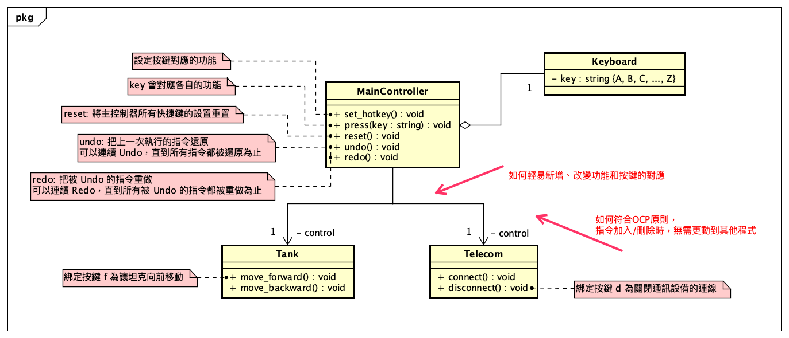
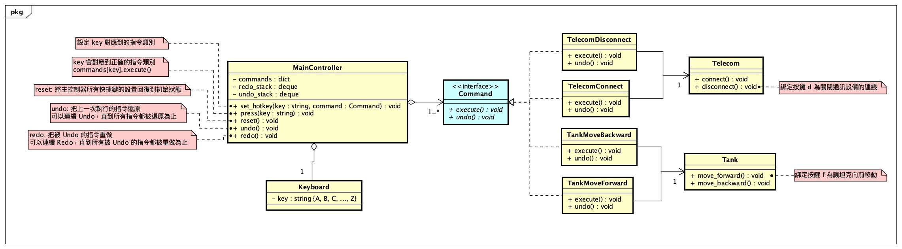

# [3.2.H] 指令模式——快捷鍵設置

> Author: @A-baoYang (jyabaodsda)

### Object Oriented Analysis



### Object Oriented Design



### Run
```bash
[root] [INFO] - Welcome to Main Controller

快捷鍵列表:

(1) 快捷鍵設置 (2) Undo (3) Redo (4) 按下字母快捷鍵執行動作:
1
設置巨集指令 (y/n): y
按下快捷鍵: G
要將哪些指令設置到快捷鍵 G 上 (輸入數字用空格隔開):
(0) TankMoveForward (1) TankMoveBackward (2) TelecomConnect (3) TelecomDisconnect
0 2
[root] [INFO] - 巨集快捷鍵設置完成 - G: [TankMoveForward, TelecomConnect]
快捷鍵列表:
G: TankMoveForward & TelecomConnect

(1) 快捷鍵設置 (2) Undo (3) Redo (4) 按下字母快捷鍵執行動作:
1
設置巨集指令 (y/n): y
按下快捷鍵: E
要將哪些指令設置到快捷鍵 E 上 (輸入數字用空格隔開):
(0) TankMoveForward (1) TankMoveBackward (2) TelecomConnect (3) TelecomDisconnect
1 3
[root] [INFO] - 巨集快捷鍵設置完成 - E: [TankMoveBackward, TelecomDisconnect]
快捷鍵列表:
G: TankMoveForward & TelecomConnect
E: TankMoveBackward & TelecomDisconnect

(1) 快捷鍵設置 (2) Undo (3) Redo (4) 按下字母快捷鍵執行動作:
1
設置巨集指令 (y/n): n
按下快捷鍵: F
要將哪一道指令設置到快捷鍵 F 上 (輸入數字):
(0) TankMoveForward (1) TankMoveBackward (2) TelecomConnect (3) TelecomDisconnect
0
[root] [INFO] - 快捷鍵設置完成 - F: TankMoveForward
快捷鍵列表:
G: TankMoveForward & TelecomConnect
E: TankMoveBackward & TelecomDisconnect
F: TankMoveForward

(1) 快捷鍵設置 (2) Undo (3) Redo (4) 按下字母快捷鍵執行動作:
1
設置巨集指令 (y/n): n
按下快捷鍵: B
要將哪一道指令設置到快捷鍵 B 上 (輸入數字):
(0) TankMoveForward (1) TankMoveBackward (2) TelecomConnect (3) TelecomDisconnect
1
[root] [INFO] - 快捷鍵設置完成 - B: TankMoveBackward
快捷鍵列表:
G: TankMoveForward & TelecomConnect
E: TankMoveBackward & TelecomDisconnect
F: TankMoveForward
B: TankMoveBackward

(1) 快捷鍵設置 (2) Undo (3) Redo (4) 按下字母快捷鍵執行動作:
1
設置巨集指令 (y/n): n
按下快捷鍵: C
要將哪一道指令設置到快捷鍵 C 上 (輸入數字):
(0) TankMoveForward (1) TankMoveBackward (2) TelecomConnect (3) TelecomDisconnect
2
[root] [INFO] - 快捷鍵設置完成 - C: TelecomConnect
快捷鍵列表:
G: TankMoveForward & TelecomConnect
E: TankMoveBackward & TelecomDisconnect
F: TankMoveForward
B: TankMoveBackward
C: TelecomConnect

(1) 快捷鍵設置 (2) Undo (3) Redo (4) 按下字母快捷鍵執行動作:
1
設置巨集指令 (y/n): n
按下快捷鍵: D
要將哪一道指令設置到快捷鍵 D 上 (輸入數字):
(0) TankMoveForward (1) TankMoveBackward (2) TelecomConnect (3) TelecomDisconnect
3
[root] [INFO] - 快捷鍵設置完成 - D: TelecomDisconnect
快捷鍵列表:
G: TankMoveForward & TelecomConnect
E: TankMoveBackward & TelecomDisconnect
F: TankMoveForward
B: TankMoveBackward
C: TelecomConnect
D: TelecomDisconnect

(1) 快捷鍵設置 (2) Undo (3) Redo (4) 按下字母快捷鍵執行動作:
G
[root] [INFO] - The tank has moved forward.
[root] [INFO] - The telecom has been turned on.
快捷鍵列表:
G: TankMoveForward & TelecomConnect
E: TankMoveBackward & TelecomDisconnect
F: TankMoveForward
B: TankMoveBackward
C: TelecomConnect
D: TelecomDisconnect

(1) 快捷鍵設置 (2) Undo (3) Redo (4) 按下字母快捷鍵執行動作:
E
[root] [INFO] - The tank has moved backward.
[root] [INFO] - The telecom has been turned off.
快捷鍵列表:
G: TankMoveForward & TelecomConnect
E: TankMoveBackward & TelecomDisconnect
F: TankMoveForward
B: TankMoveBackward
C: TelecomConnect
D: TelecomDisconnect

(1) 快捷鍵設置 (2) Undo (3) Redo (4) 按下字母快捷鍵執行動作:
F
[root] [INFO] - The tank has moved forward.
快捷鍵列表:
G: TankMoveForward & TelecomConnect
E: TankMoveBackward & TelecomDisconnect
F: TankMoveForward
B: TankMoveBackward
C: TelecomConnect
D: TelecomDisconnect

(1) 快捷鍵設置 (2) Undo (3) Redo (4) 按下字母快捷鍵執行動作:
B
[root] [INFO] - The tank has moved backward.
快捷鍵列表:
G: TankMoveForward & TelecomConnect
E: TankMoveBackward & TelecomDisconnect
F: TankMoveForward
B: TankMoveBackward
C: TelecomConnect
D: TelecomDisconnect

(1) 快捷鍵設置 (2) Undo (3) Redo (4) 按下字母快捷鍵執行動作:
C
[root] [INFO] - The telecom has been turned on.
快捷鍵列表:
G: TankMoveForward & TelecomConnect
E: TankMoveBackward & TelecomDisconnect
F: TankMoveForward
B: TankMoveBackward
C: TelecomConnect
D: TelecomDisconnect

(1) 快捷鍵設置 (2) Undo (3) Redo (4) 按下字母快捷鍵執行動作:
D
[root] [INFO] - The telecom has been turned off.
快捷鍵列表:
G: TankMoveForward & TelecomConnect
E: TankMoveBackward & TelecomDisconnect
F: TankMoveForward
B: TankMoveBackward
C: TelecomConnect
D: TelecomDisconnect

(1) 快捷鍵設置 (2) Undo (3) Redo (4) 按下字母快捷鍵執行動作:
2
[root] [INFO] - The telecom has been turned on.
快捷鍵列表:
G: TankMoveForward & TelecomConnect
E: TankMoveBackward & TelecomDisconnect
F: TankMoveForward
B: TankMoveBackward
C: TelecomConnect
D: TelecomDisconnect

(1) 快捷鍵設置 (2) Undo (3) Redo (4) 按下字母快捷鍵執行動作:
2
[root] [INFO] - The telecom has been turned off.
快捷鍵列表:
G: TankMoveForward & TelecomConnect
E: TankMoveBackward & TelecomDisconnect
F: TankMoveForward
B: TankMoveBackward
C: TelecomConnect
D: TelecomDisconnect

(1) 快捷鍵設置 (2) Undo (3) Redo (4) 按下字母快捷鍵執行動作:
2
[root] [INFO] - The tank has moved forward.
快捷鍵列表:
G: TankMoveForward & TelecomConnect
E: TankMoveBackward & TelecomDisconnect
F: TankMoveForward
B: TankMoveBackward
C: TelecomConnect
D: TelecomDisconnect

(1) 快捷鍵設置 (2) Undo (3) Redo (4) 按下字母快捷鍵執行動作:
2
[root] [INFO] - The tank has moved backward.
快捷鍵列表:
G: TankMoveForward & TelecomConnect
E: TankMoveBackward & TelecomDisconnect
F: TankMoveForward
B: TankMoveBackward
C: TelecomConnect
D: TelecomDisconnect

(1) 快捷鍵設置 (2) Undo (3) Redo (4) 按下字母快捷鍵執行動作:
2
[root] [INFO] - The tank has moved forward.
[root] [INFO] - The telecom has been turned on.
快捷鍵列表:
G: TankMoveForward & TelecomConnect
E: TankMoveBackward & TelecomDisconnect
F: TankMoveForward
B: TankMoveBackward
C: TelecomConnect
D: TelecomDisconnect

(1) 快捷鍵設置 (2) Undo (3) Redo (4) 按下字母快捷鍵執行動作:
2
[root] [INFO] - The tank has moved backward.
[root] [INFO] - The telecom has been turned off.
快捷鍵列表:
G: TankMoveForward & TelecomConnect
E: TankMoveBackward & TelecomDisconnect
F: TankMoveForward
B: TankMoveBackward
C: TelecomConnect
D: TelecomDisconnect

(1) 快捷鍵設置 (2) Undo (3) Redo (4) 按下字母快捷鍵執行動作:
2
[root] [INFO] - No action to undo.
快捷鍵列表:
G: TankMoveForward & TelecomConnect
E: TankMoveBackward & TelecomDisconnect
F: TankMoveForward
B: TankMoveBackward
C: TelecomConnect
D: TelecomDisconnect

(1) 快捷鍵設置 (2) Undo (3) Redo (4) 按下字母快捷鍵執行動作:
3
[root] [INFO] - The tank has moved forward.
[root] [INFO] - The telecom has been turned on.
快捷鍵列表:
G: TankMoveForward & TelecomConnect
E: TankMoveBackward & TelecomDisconnect
F: TankMoveForward
B: TankMoveBackward
C: TelecomConnect
D: TelecomDisconnect

(1) 快捷鍵設置 (2) Undo (3) Redo (4) 按下字母快捷鍵執行動作:
3
[root] [INFO] - The tank has moved backward.
[root] [INFO] - The telecom has been turned off.
快捷鍵列表:
G: TankMoveForward & TelecomConnect
E: TankMoveBackward & TelecomDisconnect
F: TankMoveForward
B: TankMoveBackward
C: TelecomConnect
D: TelecomDisconnect

(1) 快捷鍵設置 (2) Undo (3) Redo (4) 按下字母快捷鍵執行動作:
3
[root] [INFO] - The tank has moved forward.
快捷鍵列表:
G: TankMoveForward & TelecomConnect
E: TankMoveBackward & TelecomDisconnect
F: TankMoveForward
B: TankMoveBackward
C: TelecomConnect
D: TelecomDisconnect

(1) 快捷鍵設置 (2) Undo (3) Redo (4) 按下字母快捷鍵執行動作:
3
[root] [INFO] - The tank has moved backward.
快捷鍵列表:
G: TankMoveForward & TelecomConnect
E: TankMoveBackward & TelecomDisconnect
F: TankMoveForward
B: TankMoveBackward
C: TelecomConnect
D: TelecomDisconnect

(1) 快捷鍵設置 (2) Undo (3) Redo (4) 按下字母快捷鍵執行動作:
3
[root] [INFO] - The telecom has been turned on.
快捷鍵列表:
G: TankMoveForward & TelecomConnect
E: TankMoveBackward & TelecomDisconnect
F: TankMoveForward
B: TankMoveBackward
C: TelecomConnect
D: TelecomDisconnect

(1) 快捷鍵設置 (2) Undo (3) Redo (4) 按下字母快捷鍵執行動作:
3
[root] [INFO] - The telecom has been turned off.
快捷鍵列表:
G: TankMoveForward & TelecomConnect
E: TankMoveBackward & TelecomDisconnect
F: TankMoveForward
B: TankMoveBackward
C: TelecomConnect
D: TelecomDisconnect

(1) 快捷鍵設置 (2) Undo (3) Redo (4) 按下字母快捷鍵執行動作:
3
[root] [INFO] - No action to redo.
```